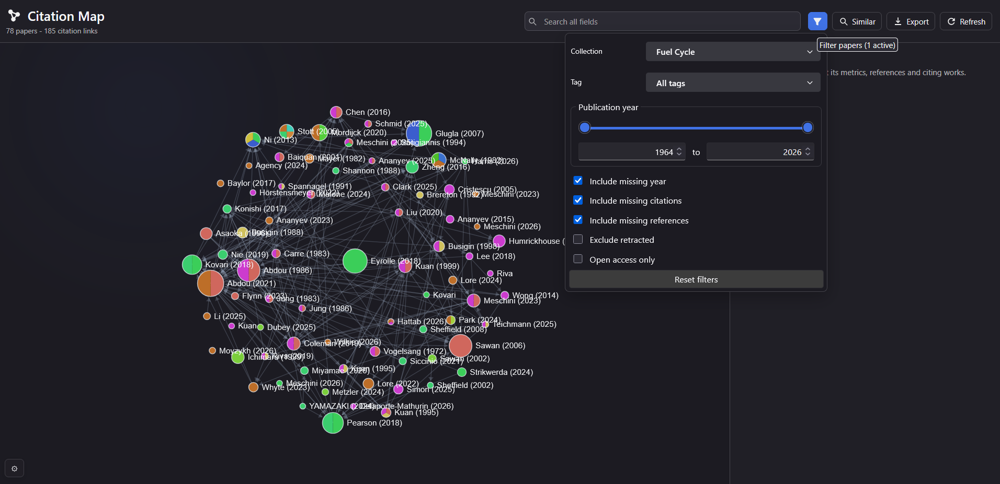
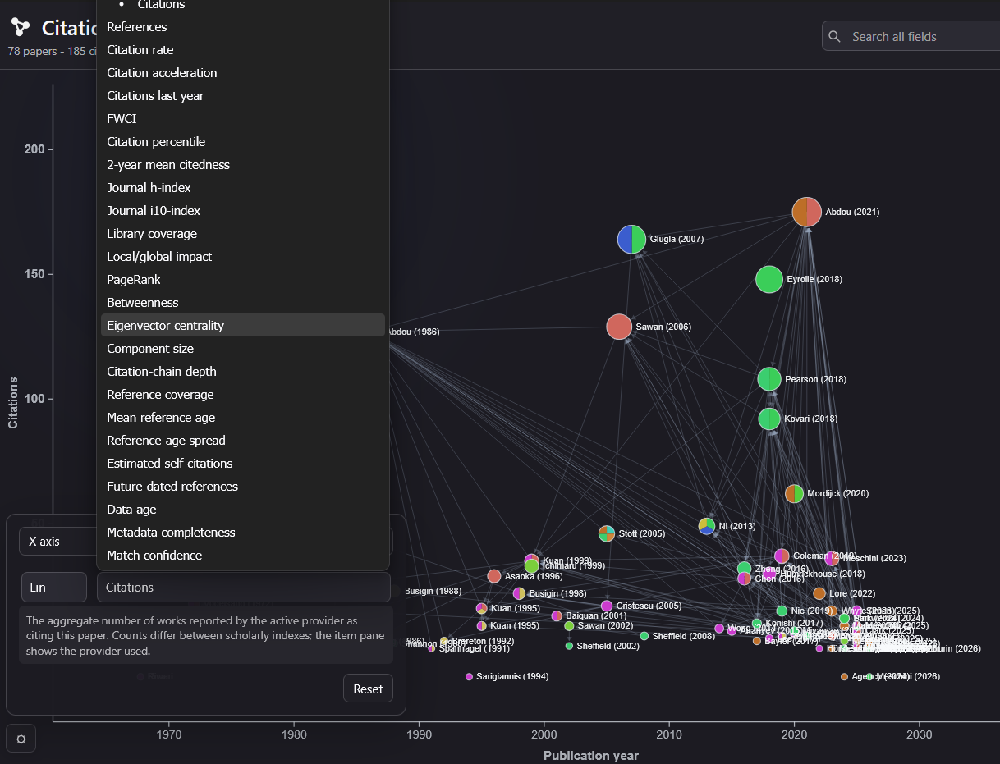
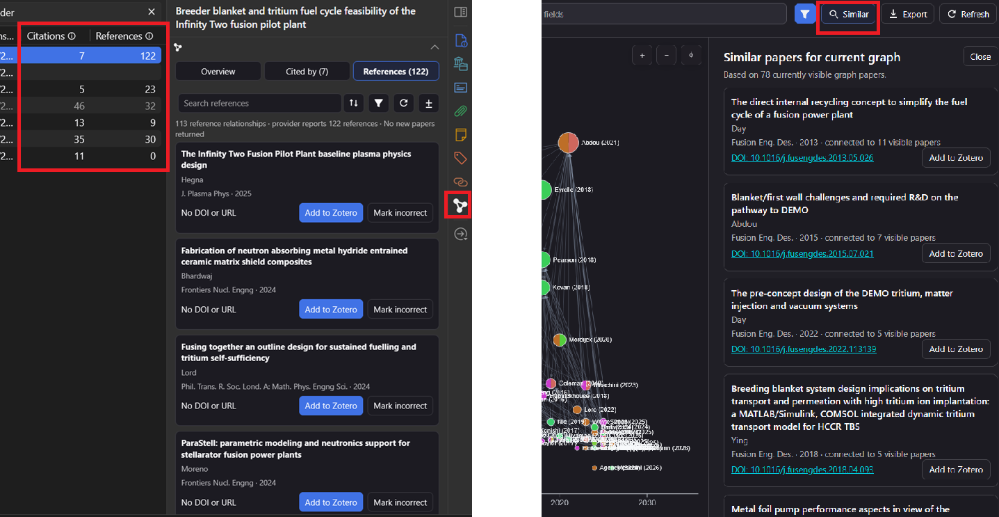

# Zotero Citation Map:

Zotero Citation Map is a plugin for visualizing the citation and reference relationships between papers in your Zotero library.

The project began as a weekend experiment. I wanted to test how far I could take ChatGPT 5.6 SOL while solving a minor annoyance in my own research workflow.

Whenever I wanted to explore the connections between a set of papers, I had to move repeatedly between Zotero and external tools such as ResearchRabbit or Litmaps. I wanted a simple way to inspect those relationships directly inside Zotero.

So I decided to see if something along those lines could be integrated directly inside Zotero... and this plugin is the result!

## Installation:

1. Open the repository’s [Releases](https://github.com/AlessMor/zotero-citation-map/releases/latest) page.

2. Under **Assets**, download the latest `.xpi` file.

   > Do not download the automatically generated **Source code** `.zip` or `.tar.gz` archives.

3. Open Zotero.

4. Go to **Tools → Plugins**.

5. Drag the downloaded `.xpi` file into the Plugins window.

6. Confirm the installation when prompted.

7. Restart Zotero if required.

The plugin should now be available in Zotero.

### Updating

Download the newest `.xpi` file from the [Releases](https://github.com/AlessMor/zotero-citation-map/releases/latest) page and repeat the installation procedure. Zotero will replace the existing version.

## Main Features

- **See how papers in your library are connected**
  Visualize which papers cite each other and which references they share.
  Generate a graph from your library or from a collection, with every library paper linked back to its Zotero item, notes and PDF. Use filters to change what you want to see.
  Papers already present in Zotero are matched to their library items, so you can quickly return to their metadata, notes and PDFs.
  

- **Customize and export your citation map view**
  Arrange papers by properties such as publication year and citation count, or secondary properties such as journal h-index.
  Use nodes colour and size to visualize other properties.
  You can export the map view as an image, CSV or JSON.
  

- **Find missing papers from several data providers**
  External papers discovered through the graph can be imported directly into Zotero when sufficient metadata are available.
  Add a paper to Zotero by either the graph view or from the properties panel in the main Zotero page.
  You can see a preview on the graph before adding any paper.
  Combine Crossref, Semantic Scholar, OpenCitations and INSPIRE and OpenAlex.
  

- **Update citation data**
  Refresh the citation and reference relationships when provider data changes or when new papers are added to your library. You can also do it manually if you want to create custom maps.

## Acknowledgements:

The project was mainly inspired by other Zotero plugins:

- [windingwind/zotero-plugin-template](https://github.com/windingwind/zotero-plugin-template)

- [zotero-cita/zotero-cita](https://github.com/zotero-cita/zotero-cita)

- [phdemotions/zotero-citegeist](https://github.com/phdemotions/zotero-citegeist)

- [eschnett/zotero-citationcounts](https://github.com/eschnett/zotero-citationcounts)

- [MuiseDestiny/zotero-style](https://github.com/MuiseDestiny/zotero-style)

- [danieleongari/zotero-openalex](https://github.com/danieleongari/zotero-openalex)

Citation and bibliographic data are retrieved from the public APIs provided by [Crossref](https://www.crossref.org/), [Semantic Scholar](https://www.semanticscholar.org/), [OpenCitations](https://opencitations.net/), [INSPIRE-HEP](https://inspirehep.net/), and [OpenAlex](https://openalex.org/). These services are independent of this project, and their respective terms, coverage, and data-quality limitations apply.
