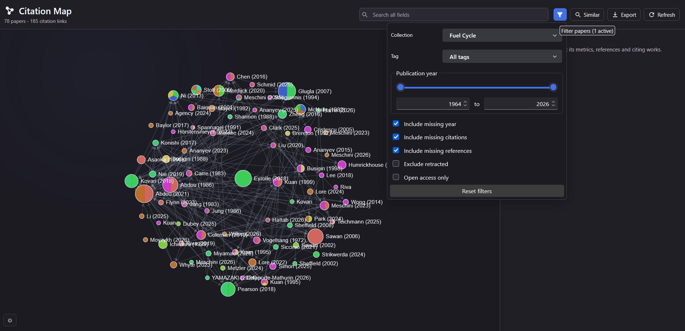
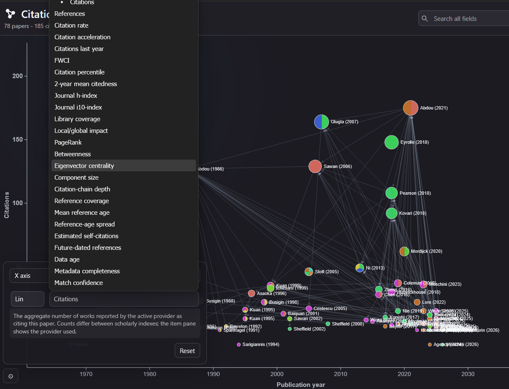
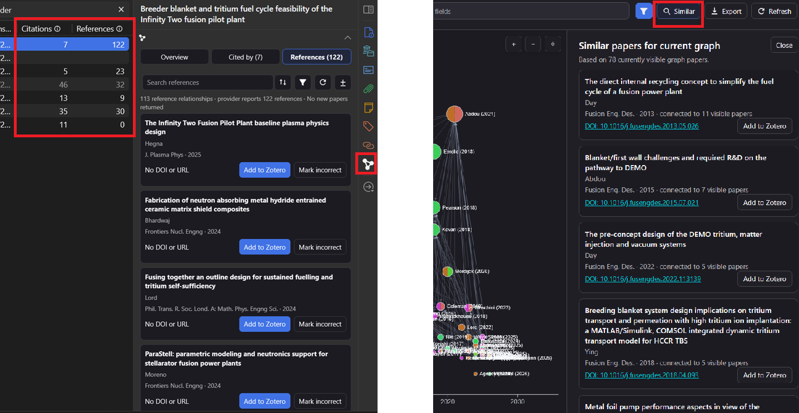

# Zotero Citation Map:

Zotero Citation Map is a plugin for visualizing the citation and reference relationships between papers in your Zotero library.

The project began as a weekend experiment. I wanted to test how far I could take ChatGPT 5.6 SOL while solving a minor annoyance in my own research workflow.

Whenever I wanted to explore the connections between a set of papers, I had to move repeatedly between Zotero and external tools such as ResearchRabbit or Litmaps. I wanted a simple way to inspect those relationships directly inside Zotero.

So I decided to see if something along those lines could be integrated directly inside Zotero... and this plugin is the result!

## Installation:

1. Open the repository’s [Releases](https://github.com/AlessMor/zotero-citation-map/releases/latest) page.

2. Under **Assets**, download the latest `.xpi` file.

   > Do not download the automatically generated **Source code** `.zip` or `.tar.gz` archives.

3. Open Zotero.

4. Go to **Tools → Plugins**.

5. Drag the downloaded `.xpi` file into the Plugins window.

6. Confirm the installation when prompted.

7. Restart Zotero if required.

The plugin should now be available in Zotero.

### Updating

Download the newest `.xpi` file from the [Releases](https://github.com/AlessMor/zotero-citation-map/releases/latest) page and repeat the installation procedure. Zotero will replace the existing version.

## Main Features

- **See how papers in your library are connected**
  Visualize which papers cite each other and which references they share.
  Generate a graph from your library or from a collection, with every library paper linked back to its Zotero item, notes and PDF. Use filters to change what you want to see.
  Papers already present in Zotero are matched to their library items, so you can quickly return to their metadata, notes and PDFs.
  

- **Focus on one or more papers and their citation neighbourhoods**
  Use **Open Focus View** from a Zotero item or from the paper details to show the seed paper with its direct references and citing papers in the existing Citation Map tab. Saved relationships are rendered immediately. Library collection scope is suspended while Focus View is active so external neighbours are not hidden, then restored when returning to the library map. Focusing a paper or choosing **Add as seed** always schedules a fresh connection update after the graph has painted. External seeds are first promoted to a stable DOI/provider identity in the background when necessary, retain PMID/arXiv/ISBN fallback identifiers, and immediately expose any references already embedded in their provider record. Provider requests, normalization, cache preparation and metadata enrichment run cooperatively in short event-loop slices while the singleton update popup reports progress. Relationship membership and reported totals are published before optional metadata enrichment, and remaining summaries are processed in small background batches. After newly introduced seeds finish their initial membership refresh, the complete focused node cloud is fitted once; later metadata-only updates preserve the camera. Graph tabs, relationship status text, Overview metrics and Zotero item-pane summaries subscribe to that same publication state, so retrieved and reported counts change together. **Update connections** performs a broader explicit refresh. The Focus paper-limit control is applied independently to every seed and to each direction, after which shared neighbours are deduplicated in the displayed union. Changing Focus controls and navigating history remain cache-only. Opening papers in a normal map adds any missing papers to that view; a newly created Citation Map View is scoped to exactly the requested papers.
  Zotero item selections and collection rows expose one icon-labelled **Citation Map** submenu. Its **Open in** submenu offers **New Citation Map View** and **New Focus View**, followed by every currently open named view. Selecting an existing normal map adds missing papers while preserving its scope; selecting an existing Focus View adds only missing seeds. The **Tools → Citation Map** submenu is intentionally library-level and contains only **New Citation Map View**, **New Focus View**, **Refresh Library**, and **Settings**. A Tools-created Citation Map opens the complete current library, while a Tools-created Focus View starts empty. New views are named **Citation Map**, **Citation Map 2**, and so on, or **Focus View**, **Focus View 2**, and so on. Right-click a Citation Map tab and choose **Rename View…** to assign a persistent custom name. Each view has its own camera, filters, axes, selection and Focus history. Hidden Citation Map tabs defer graph redraws until activated, while shared provider/cache work remains deduplicated. The reserved Zotero library tab is never reused as a Citation Map host.
  Inspect local and external nodes through the same Overview, References and Cited-by panels. External papers can be explored without importing them, explicitly added to Zotero, used as a replacement seed, or added as another seed in the current Focus View.
  Every graph uses a two-band header. The top band identifies the current view type and visible node/link totals, and provides **Add Node**, **Similar**, **Export**, and **Refresh** actions. **Add Node** uses Zotero's `quicksearch-titleCreatorYear` search across the complete current library, ranks title matches ahead of creator and other main-property matches, supports multi-selection, and adds papers without clearing active filters. In a Focus View the selected papers become seeds; in a Citation Map they are added to the map scope. The lower band contains the current-view **Search all fields** box and filter control. Similar-paper discovery, export, and metadata/citation refresh operate only on papers currently visible after search and filtering.
  Switch between references, cited-by, or both; include external papers or restrict the view to Zotero; rank and limit each side; remove individual seeds; and navigate back and forward between focus states. Shared neighbours are deduplicated and prioritized in multi-seed relevance ranking.
  Seeds and the selected paper remain visible when ordinary filters exclude them.

- **Customize and export your citation map view**
  Arrange papers by properties such as publication year and citation count, or secondary properties such as journal h-index.
  Use **Citation sequence** on either axis or for node colour to display equal ordinal publication steps instead of proportional calendar spacing. In Focus View, the primary seed is step 0, references are negative steps and citing papers are positive steps; Citation sequence is the default Focus View X axis.
  Use nodes colour and size to visualize other properties.
  You can export the map view as an image, CSV or JSON.
  

- **Find missing papers from several data providers**
  External papers discovered through the graph can be imported directly into Zotero when sufficient metadata are available.
  Add a paper to Zotero by either the graph view or from the properties panel in the main Zotero page.
  You can see a preview on the graph before adding any paper.
  Combine Crossref, Semantic Scholar, OpenCitations and INSPIRE and OpenAlex.
  

- **Update citation data**
  Refresh the citation and reference relationships when provider data changes or when new papers are added to your library. You can also do it manually if you want to create custom maps.

## Acknowledgements:

The project was mainly inspired by other Zotero plugins:

- [windingwind/zotero-plugin-template](https://github.com/windingwind/zotero-plugin-template)

- [zotero-cita/zotero-cita](https://github.com/zotero-cita/zotero-cita)

- [phdemotions/zotero-citegeist](https://github.com/phdemotions/zotero-citegeist)

- [eschnett/zotero-citationcounts](https://github.com/eschnett/zotero-citationcounts)

- [MuiseDestiny/zotero-style](https://github.com/MuiseDestiny/zotero-style)

- [danieleongari/zotero-openalex](https://github.com/danieleongari/zotero-openalex)

Citation and bibliographic data are retrieved from the public APIs provided by [Crossref](https://www.crossref.org/), [Semantic Scholar](https://www.semanticscholar.org/), [OpenCitations](https://opencitations.net/), [INSPIRE-HEP](https://inspirehep.net/), and [OpenAlex](https://openalex.org/). These services are independent of this project, and their respective terms, coverage, and data-quality limitations apply.
